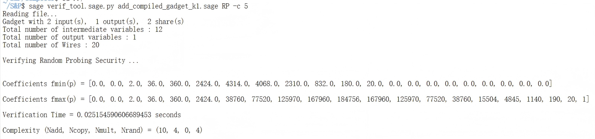
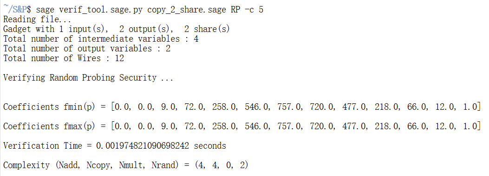
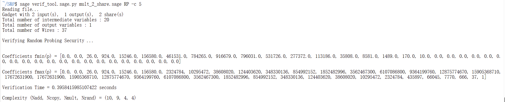
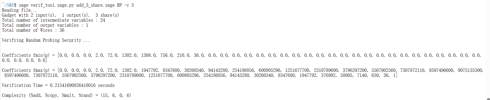
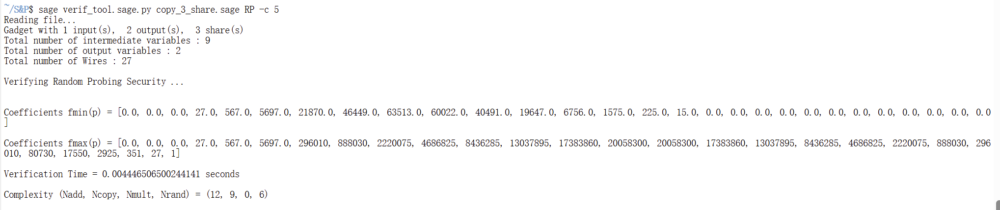
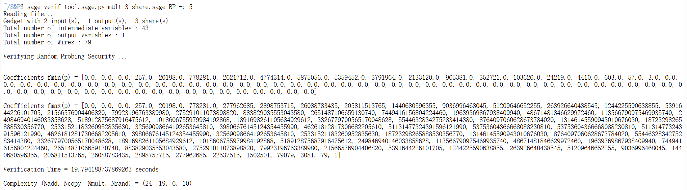

This project provides a SageMath code implementation of basic gadgets for constructing iterable masked gadgets, including six fundamental operations: addition, copy, and multiplication (each supporting both 2-share and 3-share). Additionally, the project offers the open-source VRAPS tool for evaluating the security of these basic gadgets under random probing attacks.

File Structure Description：

**basic gadget directory**:

This directory contains SageMath code for the six basic gadgets designed in this paper.

- 2_share_add.sage, 3_share_add.sage：Implementation of 2-share and 3-share basic addition gadgets：
  $$
  G_{iter\_add}^2 、 G_{iter\_add}^3
  $$
  
- 2_share_copy.sage, 3_share_copy.sage：Implementation of 2-share and 3-share basic copy gadgets：
  $$
  G_{iter\_copy}^2 、 G_{iter\_copy}^3
  $$
  
- 2_share_mult.sage, 3_share_mult.sage：Implementation of 2-share and 3-share basic multiplication gadgets：
  $$
  G_{iter\_mul}^2 、 G_{iter\_mul}^3
  $$
  

**VRAPS Directory**：

This folder contains the VRAPS tool for evaluating the random probing security of basic gadgets.

- VRAPS is an open-source random probing analysis tool provided in reference [16].
- This tool can be used to analyze the security of all basic gadgets designed in this paper.


**Security Analysis Example: Evaluating 2-share Copy Basic Gadget**

This example demonstrates how to use the VRAPS tool to evaluate the random probing security of the `2_share_copy.sage` basic gadget and obtain the simulation failure probability.

Steps：

1.  Copy gadget file: Copy the `2_share_copy.sage` file from the `basic gadgets/` directory to the `VRAPS/` directory.

2.  Navigate to the `VRAPS/` folder in the terminal and execute the following command to view the tool usage instructions:

   ```
   sage verif_tool.sage -h
   ```

3.  Run the following command to perform random probing security analysis on the `2_share_copy.sage` gadget:

```
sage verif_tool.sage 2_share_copy.sage RP -c 5
```

Execution results show: 

```
Reading file...
Gadget with 1 input(s),  2 output(s),  2 share(s)
Total number of intermediate variables : 4
Total number of output variables : 2
Total number of Wires : 12

Verifying Random Probing Security ...


Coefficients fmin(p) = [0.0, 0.0, 9.0, 72.0, 258.0, 546.0, 757.0, 720.0, 477.0, 218.0, 66.0, 12.0, 1.0]

Coefficients fmax(p) = [0.0, 0.0, 9.0, 72.0, 258.0, 546.0, 757.0, 720.0, 477.0, 218.0, 66.0, 12.0, 1.0]

Verification Time = 0.03077554702758789 seconds

Complexity (Nadd, Ncopy, Nmult, Nrand) = (4, 4, 0, 2)
```

Coefficients represent the constant term in the failure probability at order 5.2; we take the approximation: 
$$
f_{Iter\_COPY1}(p) = 9*p^2 + 72*p^3 + 258*p^4 + O(p^5 )
$$
The current calculation results for the 2-share COPY basic gadget correspond to formula (12) in the paper. For the full n-share COPY iterable gadget, its security requires further computational derivation based on subsequent formulas in the paper.


**Experimental Results**: Simulation Failure Probability of Basic Gadgets

The table below presents the simulation failure probabilities for six basic gadgets evaluated using the VRAPS tool. These results correspond to the design schemes specified by the following formulas in the paper:

- **Addition gadget**：Iter-ADD1, Iter-ADD2
- **Copy gadget**：Iter-COPY1, Iter-COPY2
- **Multiplication gadget**：Iter-MUL1, Iter-MUL2

$$
f_{Iter\_ADD1}(p) = 2*p^2 + 36*p^3 + 360*p^4 + O(p^5 )
$$



$$
f_{Iter\_COPY1}(p) = 9*p^2 + 72*p^3 + 258*p^4 + O(p^5 )
$$


$$
f_{Iter\_MUL1}(p) = 26*p^2 + 924*p^3 + 15246*p^4 + O(p^5 )
$$


$$
f_{Iter\_ADD2}(p) = 2*p^3 + 72*p^4 + 1302*p^5 + O(p^6 )
$$


$$
f_{Iter\_COPY2}(p) = 27*p^3 + 567*p^4 + 5697*p^5 + O(p^6 )
$$


$$
f_{Iter\_MUL2}(p) = 257*p^3 + 20198*p^4 + 778281*p^5 + O(p^6 )
$$


